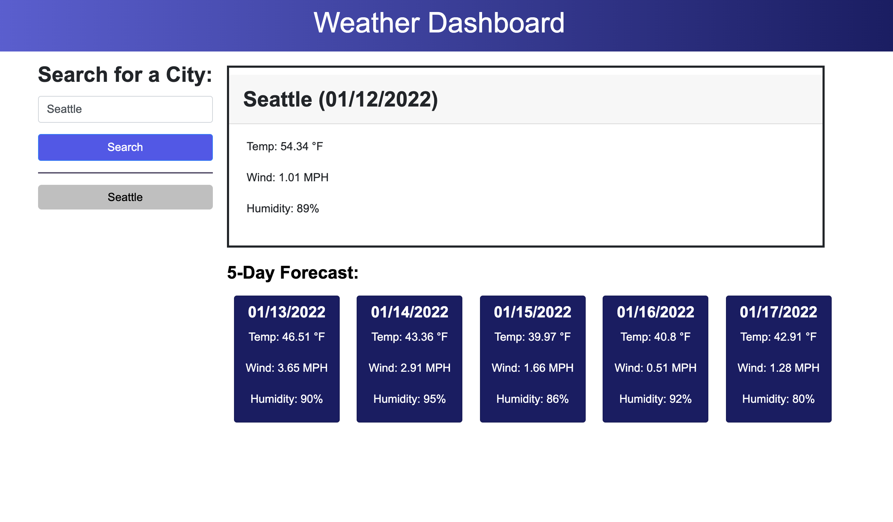

# Weather Dashboard

## Description 
Weather dashboard allows users to search current and future weather conditions of any city in the world. Simply enter a city name into the search engine. Then the user is presented with that city's name, the current date, and the weather conditions. Weather conditions include temperature, wind, and humidity. The user is also presented with future weather conditions with a five-day forecast. 

## Screenshot

## Link 

Check out the app on Github Pages: https://stephtf.github.io/weather-dashboard/

## Questions 

If you have any questions about the repo, open an issue or contact me directly at stfajardo@gmail.com. You can find more of my work at [stephtf](https://github.com/stephtf/) or by visiting my website at [https://www.stephfajardo.com](https://www.stephfajardo.com).
